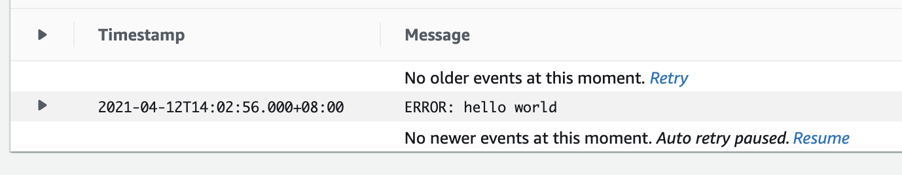
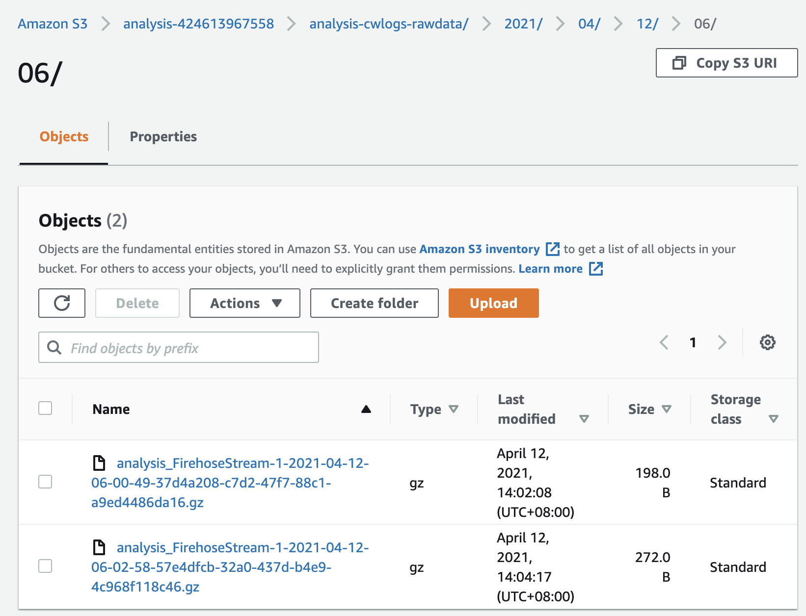
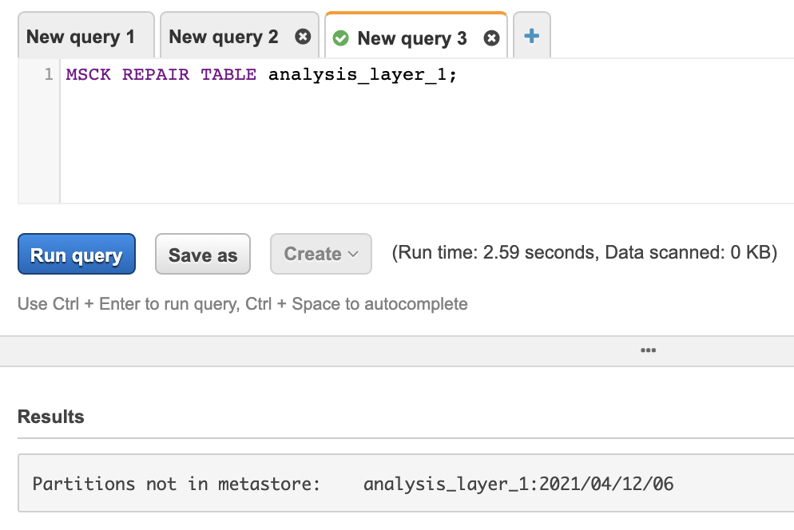
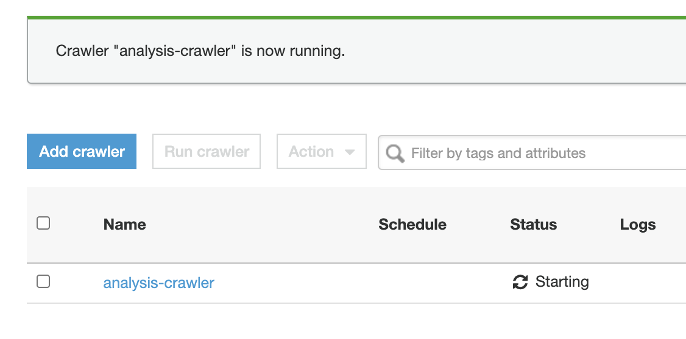
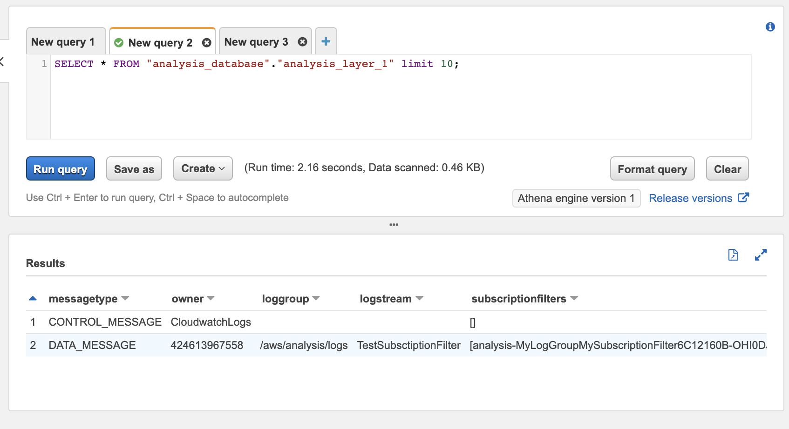

# Readme

## flow

## CMD
- `cdk deploy`

# Firehose, Transform source records with AWS Lambda
- You transform each log event within Lambda func.

# Operation Flow

## 1. Put log event to CWLogs

- GUI
    1. go to Log Group `/aws/analysis/logs`
    2. Create log event `ERROR: hello world`
- AWS CLI
    - `aws logs put-log-events --log-group-name /aws/analysis/logs --log-stream-name TestSubsctiptionFilter --log-events timestamp=$(date +%s000),message='ERROR: hello world'`

## 2. Wait the log move into S3 Bucket

- Base on the Firehose's buffer conditions, wait the log file move on the S3 Bucket.
    - Could verify the log file by S3 Select.

## 3. Athena, to check the Glue table partition

1. Athena query : `MSCK REPAIR TABLE rawdata;`
2. If fine, should get `Query successful.` response.
    - Jump to STEP_5
3. If Not, will get like `Partitions not in metastore:	rawdata:2021/04/12/03`
    - Go to STEP_4 to update the partition.

## 4. Glue, run Crawler: analysis-crawler

1. Run Crawler: analysis-crawler
2. Make sure the `analysis-crawler` is done.

## 5. Athena, exec query, to get data from Glue table 

1. Athena query : `SELECT * FROM "analysis_database"."rawdata" limit 10;`
2. If you find the empty value, go to STEP_3 to check the partitions.

## 6. (optional) QuickSight

- You could integration QuickSight and Athena
